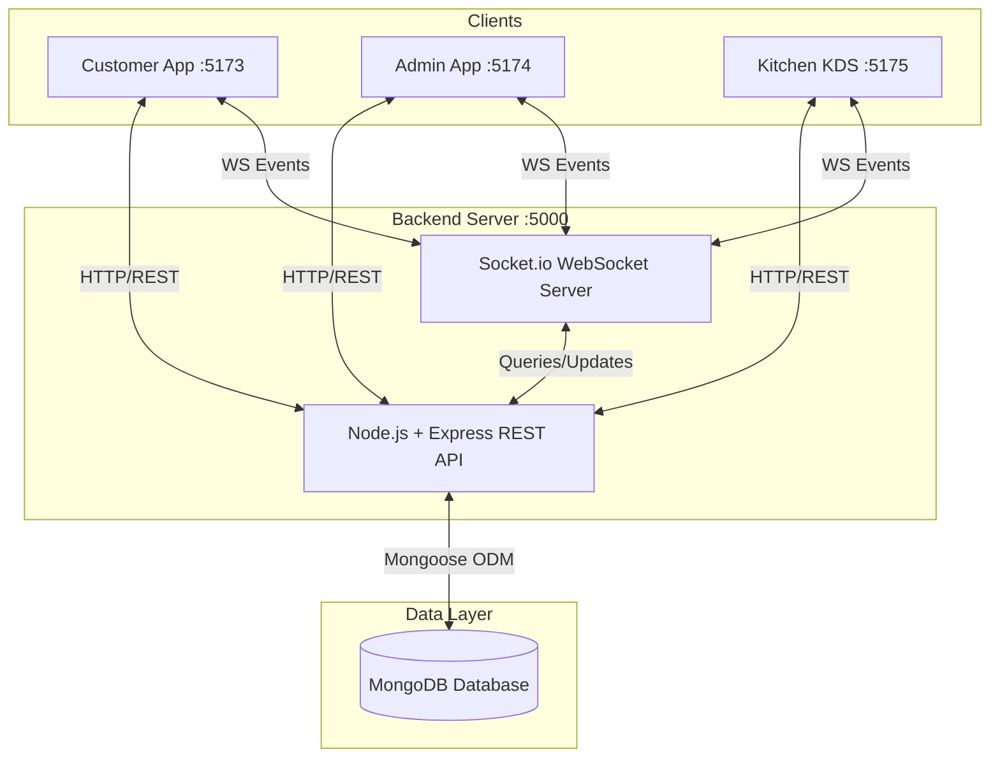

# FlavorDash: Restaurant Management System

A full-stack, real-time web application designed to digitize restaurant operations. FlavorDash seamlessly connects Customers placing orders, Kitchen Staff preparing food, and Administrators managing the business through three distinct frontend clients communicating with a central Node.js backend via REST APIs and WebSockets.

## Key Features

- **Real-Time Kitchen Display System (KDS):** Instant order synchronization using Socket.io. Kitchen staff see new orders immediately with live timers and status indicators.
- **Customer Ordering & Tracking:** Customers can browse menus, apply promotional codes, place orders, and receive real-time updates and audio notifications when their food is ready.
- **Admin Dashboard:** Comprehensive management of Food Items, Users, and Promotional Codes via a secure JWT-authenticated portal.
- **Automated CI/CD Pipeline:** Fully configured GitHub Actions workflow for automated testing (Jest, Vitest), Static Code Analysis (ESLint), and production builds.

---

## System Architecture

FlavorDash is built on a distributed **Client-Server Architecture**. It features three distinct React Single Page Application (SPA) clients communicating with a central Node.js/Express backend server, which interfaces with a MongoDB database. 

- **Frontend Clients:** React (TypeScript), Vite, TailwindCSS, Vitest
- **Backend API:** Node.js, Express, MongoDB (Mongoose), Socket.io, Jest/Supertest

### Architecture Diagram



**Data Flow:**
1. Clients make asynchronous HTTP requests to the Express API to fetch data or trigger state changes (e.g., placing an order).
2. The Express API processes business logic and interacts with MongoDB via Mongoose.
3. Upon a successful database update, the backend emits real-time WebSocket events back to connected clients in specific rooms (e.g., `admin`, `kitchen`) to keep their UI synchronized without manual polling.

---

## 🚀 Quick Start & Installation

Follow these steps to run the complete system locally.

### Prerequisites
- **Node.js** (v18 or higher)
- **MongoDB** (Running locally on port `27017` or via a MongoDB Atlas connection string)

### 1. Database Configuration
Ensure MongoDB is running locally. If you prefer MongoDB Atlas, you will need to replace the `MONGO_URI` in the `.env` file in the next step.

### 2. Backend Setup
Open a terminal and navigate to the backend directory:
```bash
cd backend
npm install

# Create environment configuration
cat <<EOT > .env
NODE_ENV=development
PORT=5000
MONGO_URI=mongodb://localhost:27017/restaurant_ordering
JWT_SECRET=your_super_secret_jwt_key
JWT_EXPIRE=30d
EOT

# Start the development server
npm run dev
```
*The backend should start on `http://localhost:5000`.*
### 3. Database Seeding & Test Credentials
To populate the database with initial food items, promo codes, and test users, run the seeder:
```bash
npm run seed
```

**Default Test Accounts:**
- **Admin:** `admin@flavordash.com` / `password123`
- **Kitchen:** `kitchen@flavordash.com` / `password123`
- **Customer:** `customer@flavordash.com` / `password123`

### 4. Frontend Clients Setup
You will need to open **three separate terminal windows**, one for each frontend client.

**Terminal 1: Customer App**
```bash
cd frontend
npm install
npm run dev
# Running on http://localhost:5173
```

**Terminal 2: Admin Dashboard**
```bash
cd admin
npm install
npm run dev
# Running on http://localhost:5174
```

**Terminal 3: Kitchen Display System (KDS)**
```bash
cd kitchen
npm install
npm run dev
# Running on http://localhost:5175
```

---

## Testing & CI/CD Results

FlavorDash includes a comprehensive testing suite utilizing **Jest** (Backend) and **Vitest** (Frontend). Below are the results from our latest automated CI run demonstrating the success of the system architecture.

### How to Run Tests Locally
To run the automated tests manually on your machine:

**Backend Tests (Jest & Supertest)**
```bash
cd backend
npm run test
```

**Frontend Tests (Vitest)**
```bash
cd frontend
npx vitest run
```

### Backend Integration & Unit Tests (Jest CI Results)

```text
> flavordash-backend@1.0.0 test
> jest

PASS tests/unit/helpers.test.ts (5.326 s)
  Helper Utils
    generateOrderNumber
      √ should generate a valid order number starting with ORD- (10 ms)
    Verification Codes
      √ should generate a 6-digit code (1 ms)
      √ should correctly verify codes
    Expiry Dates
      √ should correctly determine expiration (1 ms)
    calculateOrderTotals
      √ should calculate totals correctly without discount (1 ms)

PASS src/tests/auth.test.ts (8.433 s)
  Auth Endpoints
    √ should return 401 when trying to access a protected route without a token (32 ms)
    √ should pass a basic equality test

PASS tests/integration/health.test.ts (8.432 s)
  Health Check API
    √ should return 200 OK for /api/health (35 ms)

Test Suites: 3 passed, 3 total
Tests:       8 passed, 8 total
Snapshots:   0 total
Time:        9.691 s, estimated 26 s
Ran all test suites.
```

### Frontend Component Tests (Vitest)

```text
> flavordash-frontend@0.0.0 test
> vitest run --pool=forks

 RUN  v4.1.11 /project-root/frontend

 ✓ src/components/ImageFallback.test.tsx (4 tests) 47ms
   ✓ ImageFallback Component
     ✓ renders without crashing
     ✓ applies custom className
     ✓ renders the correct default icon size (md)
     ✓ renders the correct custom icon size (xl)

 Test Files  1 passed (1)
      Tests  4 passed (4)
   Start at  00:58:56
   Duration  12.73s (transform 502ms, setup 7.88s, import 1.40s, tests 47ms)
```

### Static Code Analysis (ESLint)

```text
> flavordash-backend@1.0.0 lint
> eslint src/ --ext .ts

✔ 0 errors, 84 warnings (Strict-typing warnings only).
Code architecture adheres to DRY and Single Responsibility Principles.
```

